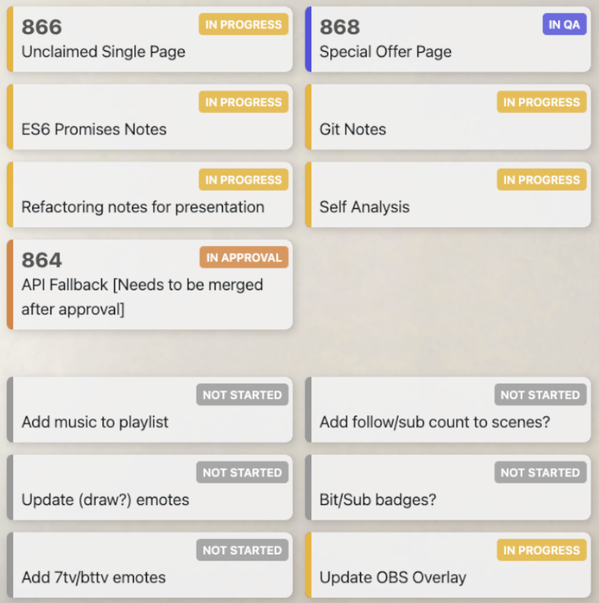

# Stream Overlays

- [To Do List Overlay](#to-do-list-overlay)
- [Chat CSS](#chat-css)

## How To Run During Stream

1. Run `npx http-server [path] [options]` or  `npm start`
2. Visit `http://localhost:8080`

---

### To Do List Overlay

The # represents the ticket (task) number, the colored badge is the status, and the text gives a brief description of the task. The top portion of task is work-related and the bottom is life-related (sometimes hidden by petcam).

#### To do

- [x] ~~No ticket ## tasks?~~
- [ ] HTML manual edit to JS edit
- [ ] Be able to update to do list in browser
- [ ] Control through chat `!issue open <ticket num> <description>`
  - Look up IRC bots + how they work (to pass data)
- [ ] Allow viewers to add to a viewer task list

### Chat CSS

CSS file for streamlabs chatbox overlay